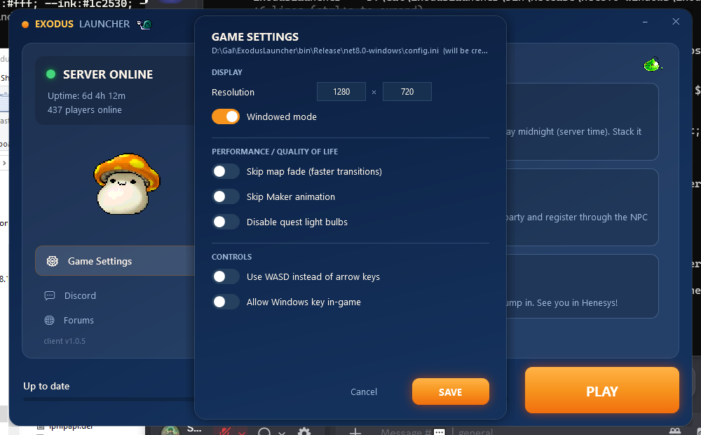

# Exodus Launcher

A modern auto-patching launcher for the Exodus MapleStory v83 server, in the
**classic MapleStory look** — warm orange over deep ocean blue.



## What it does

| Feature | Detail |
|---|---|
| **Auto-patcher** | Fetches a manifest, SHA-256–compares every file against the local install, downloads **only what changed**, verifies each download, then launches the game. |
| **Smart cache** | `patchcache.json` keyed by (size, mtime) lets repeat launches skip re-hashing unchanged files, so checks are near-instant after the first run. |
| **Server status** | Polls a `status.json` and shows ONLINE/OFFLINE, **uptime**, and players online (no per-channel clutter). |
| **News + Patch Notes** | Two tabs, each from its own feed (`news.json`, `patchnotes.json`). |
| **In-launcher settings** | GUI editor for the game's `config.ini` (resolution, windowed, skip-fade, skip-maker, lightbulbs, WASD, Windows key) — comment-and-order preserving. |
| **MapleStory flavor** | Cute Maple mob sprites (Orange Mushroom, Slime, Snail) pulled from `maplestory.io`, in the classic orange-on-ocean-blue look. |

Zero external NuGet dependencies — `System.Text.Json` and SHA-256 ship with .NET 8.

## Build

```powershell
dotnet build ExodusLauncher.csproj -c Release
# output: bin\Release\net8.0-windows\ExodusLauncher.exe
```

To ship a single self-contained exe (no .NET install needed on the player's PC):

```powershell
dotnet publish ExodusLauncher.csproj -c Release -r win-x64 `
  --self-contained true -p:PublishSingleFile=true -p:IncludeNativeLibrariesForSelfExtract=true
```

Drop the resulting `ExodusLauncher.exe` + `launcher.config.json` into the Exodus
game folder (next to `Exodus.exe`).

## Configuration — `launcher.config.json`

```json
{
  "manifest_url":    "https://your-host/manifest.json",
  "status_url":      "https://your-host/status.json",
  "news_url":        "https://your-host/news.json",
  "patch_notes_url": "https://your-host/patchnotes.json",
  "game_exe":        "Exodus.exe",
  "game_args":       "",
  "game_dir":        ".",
  "discord_url":     "https://discord.gg/exodus",
  "forum_url":       "https://exodusms.com/forums"
}
```

`game_dir: "."` means "the folder the launcher is in." All endpoints fail soft —
if the patch server is down the player can still **PLAY OFFLINE**; if status/news
are down the UI shows graceful fallbacks.

## Backend (`backend/`)

The launcher needs three JSON files on any static host and a mirror of the game files.

1. **Generate the manifest** from a known-good build of the client:

   ```powershell
   ./backend/generate-manifest.ps1 `
     -GameDir "D:\Gal\Exodus" `
     -OutDir  ".\dist" `
     -BaseUrl "https://your-host/files" `
     -Version "1.0.5"
   ```

   This writes `dist/manifest.json` and mirrors every file under `dist/files`.

2. **Host it.** Upload the contents of `dist/` to any static host or object
   storage — Cloudflare R2, Vercel, S3, OVH, or plain nginx.
   `status.json` and `news.json` you maintain by hand (or generate from the
   server / the existing exodus-status page).

3. **Local demo** (no hosting needed — for showing it off):

   ```powershell
   node backend/serve.js 8777 backend/dist
   ```

   `status.json` / `news.json` fall back to `backend/stub/` so the full UI lights up.

## Manifest format

```json
{
  "version": "1.0.5",
  "published_utc": "2026-06-14T13:44:15Z",
  "base_url": "https://your-host/files",
  "client_exe": "Exodus.exe",
  "files": [
    { "path": "Data/Mob/8800000.img", "size": 12345, "sha256": "abc123…" }
  ]
}
```

Each file downloads from `base_url + path` (or an optional per-file `url`).

## Design notes

Standard launcher architecture — a published manifest, client-side hash-diff, and
CDN-hosted file delivery — with a few extras on top: **server status with uptime**,
**News + Patch-Notes tabs**, and an **in-launcher `config.ini` editor**, all in the
original MapleStory colors with cute Maple mob sprites.
